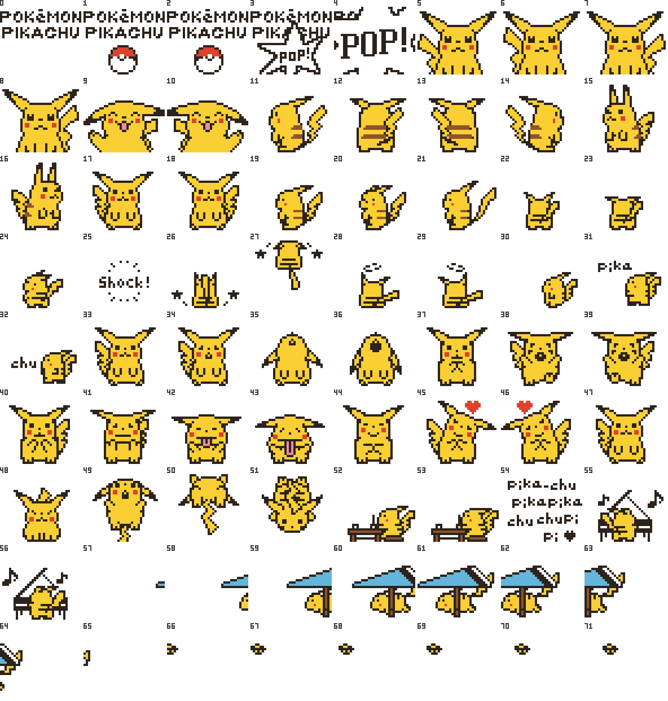
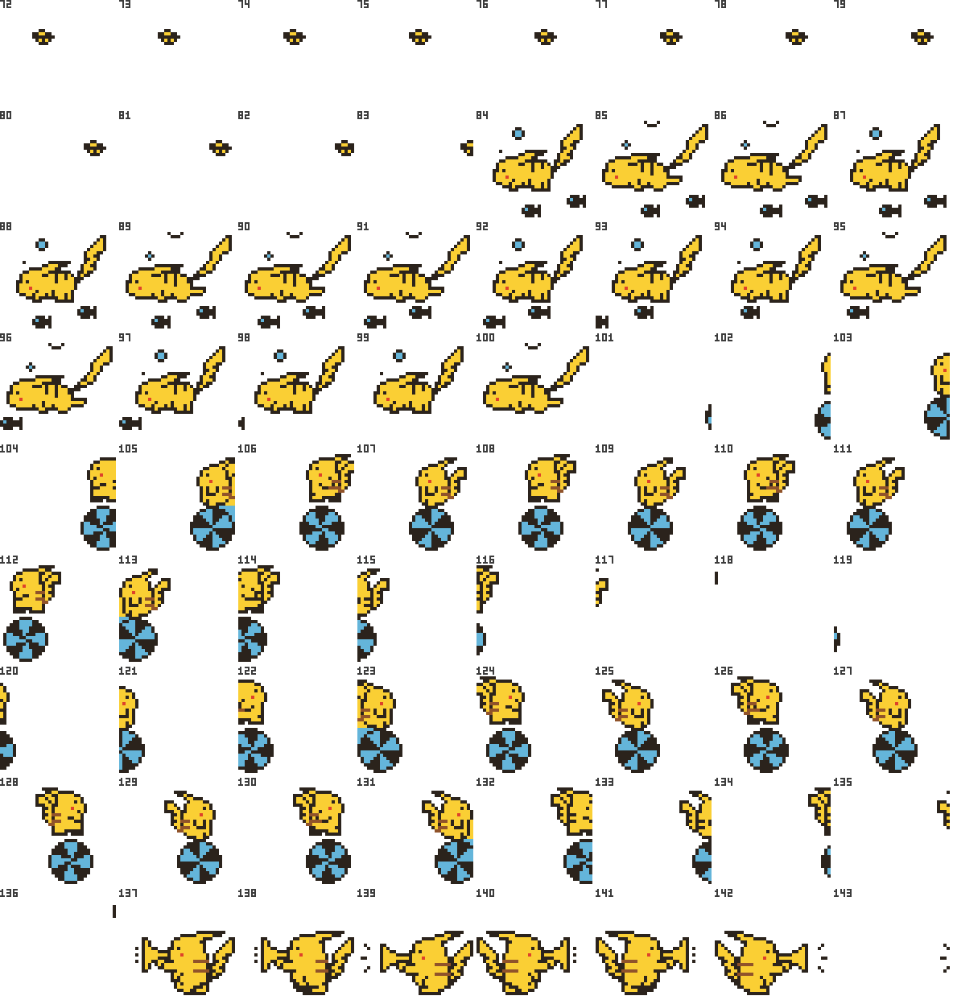
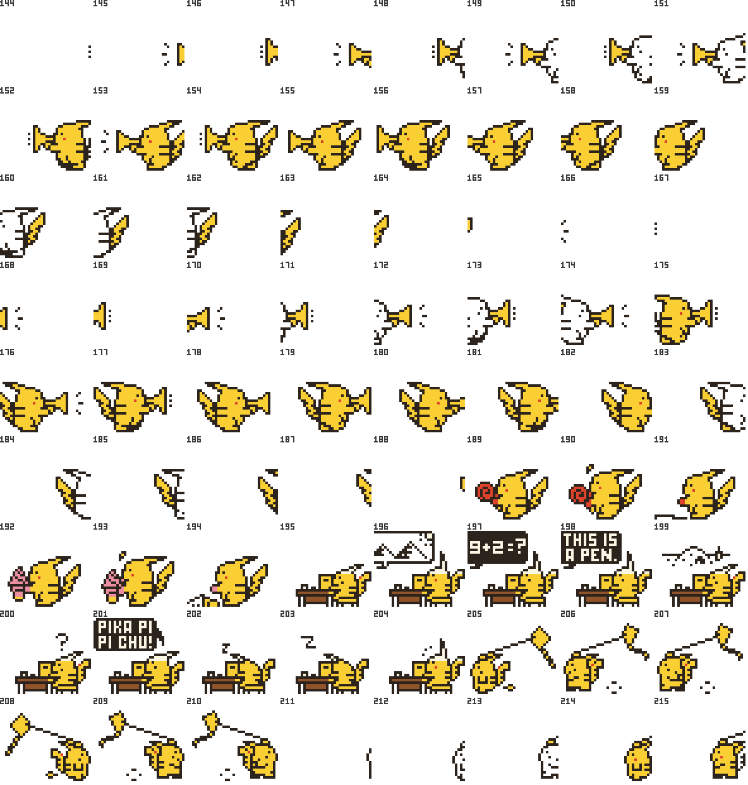
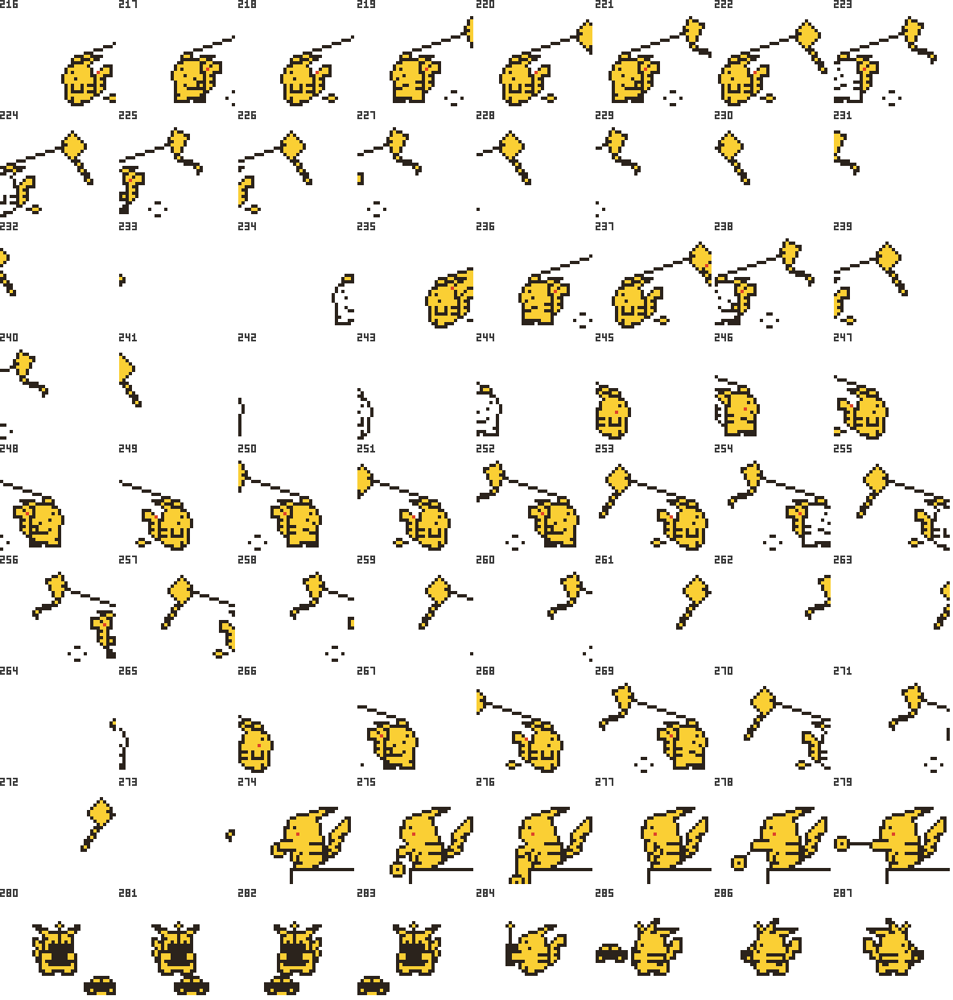
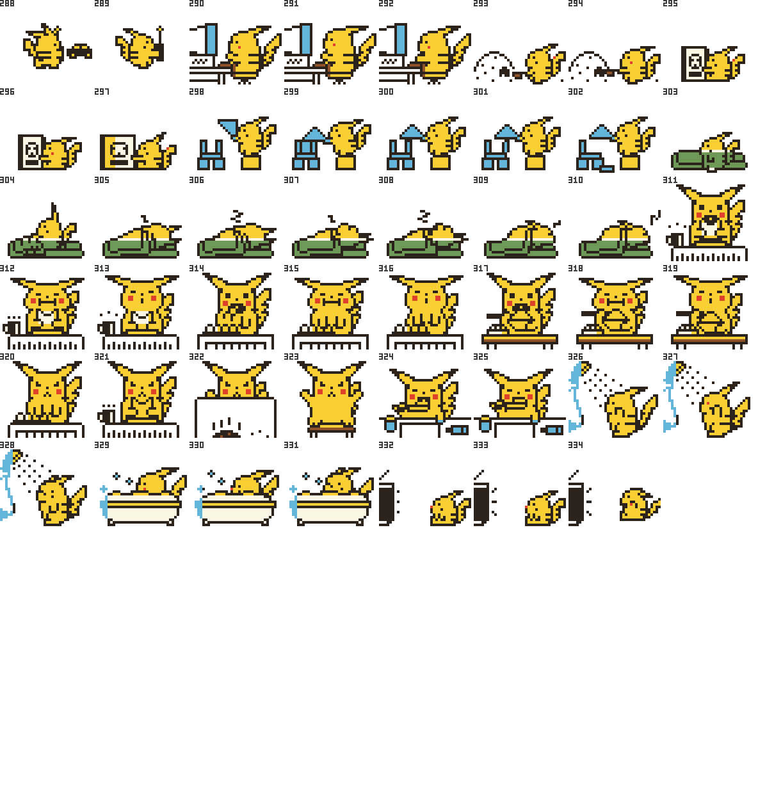
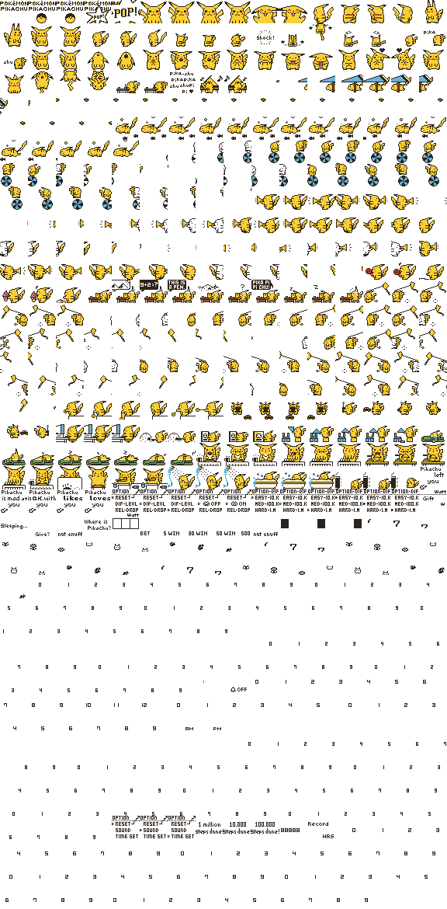
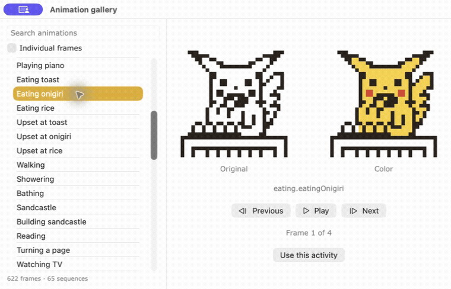

# Pocket Pikachu Emulator Mac

A fan-made browser recreation of the late-90s Pocket Pikachu walking toy. Visit **[pokpik.life](https://pokpik.life/)** to play, or download this repository and run it locally.

This repository is a fork of [Alberto-rp’s Pocket Pikachu Emulator](https://github.com/Alberto-rp/Pocket-pikachu-emulator). Thank you to Alberto-rp for creating the original project that this work builds on.

<p align="center">
  
</p>

> This is an independent, non-commercial fan project and is not affiliated with or endorsed by Nintendo, Creatures, GAME FREAK, or The Pokémon Company. Pokémon and related characters and artwork belong to their respective owners. This repository does not currently include a license granting rights to redistribute those assets; see the note under [Artwork and rights](#artwork-and-rights).

## Play online

Open **[pokpik.life](https://pokpik.life/)** in a modern browser. The emulator runs in the page; there is no account or installer.

## Download and run locally

1. On GitHub, choose **Code → Download ZIP**, then unzip the download. Or clone the repository:

   ```sh
   git clone https://github.com/masmoriya/Pocket-pikachu-emulator-Mac.git
   cd Pocket-pikachu-emulator-Mac
   ```

2. Open `index.html` in a modern browser.

If your browser restricts local files, start a small local web server from the project folder instead:

```sh
python3 -m http.server 8000
```

Then visit [http://localhost:8000](http://localhost:8000).

No build step or package installation is needed for the web emulator. The separate native macOS companion is documented in [`mac/README.md`](mac/README.md); it is a different app with its own requirements and distribution status.

## What you can do

- Watch Pikachu sleep, eat, greet you, bathe, brush his teeth, and play.
- Choose activities such as reading, studying, building blocks, flying a kite, playing with a yo-yo, and more.
- Shake the device to add steps and earn watts.
- Track friendship through five moods, from away to love, and bring Pikachu back after he leaves.
- Play the slot machine and give gifts with different reactions.
- Set a step goal of 10,000, 100,000, or 1,000,000 steps and unlock milestone animations.
- Use the clock, step counter, and settings menus.

## Sprites, colors, and animation

The animation library contains **622 source frames**: 335 character frames and 287 device/interface frames. The character contact sheets show every character pose across five pages; the color and monochrome atlases contain the complete extracted frame library. Click any image to open its full-size version.

### Every character pose in color

These five color sheets cover all 335 extracted character frames. Select a sheet to open the full-size image.

<p align="center">
  <a href="art/review-1.png"></a>
  <a href="art/review-2.png"></a>
  <a href="art/review-3.png"></a>
  <a href="art/review-4.png"></a>
  <a href="art/review-5.png"></a>
</p>

### Complete frame atlases

| Color frame atlas | Original monochrome frame atlas |
| --- | --- |
| [](mac/Sources/PocketPikachu/Resources/color-atlas.png) | [](mac/Sources/PocketPikachu/Resources/mono-atlas.png) |

The color atlas includes the complete extracted frame library; character frames are colored and the device/interface frames retain their original monochrome appearance. See [`art/contact-sheet.png`](art/contact-sheet.png) for a quick overview of animation groups and [`art/review-index.json`](art/review-index.json) for the character-sheet frame order. The atlas manifest and playback sequences are in [`mac/Sources/PocketPikachu/Resources/animations.json`](mac/Sources/PocketPikachu/Resources/animations.json).

### macOS animation gallery

The macOS companion gallery compares the original monochrome sprite with its color version, lets you browse each activity, and steps through individual frames. This short GIF cycles through real gallery captures of eating, reading, and walking:

<p align="center">
  <a href="art/animation-gallery.gif"></a>
</p>

<details>
  <summary>Open individual gallery screenshots</summary>

  - [Walking](art/gallery-walking.png)
  - [Eating onigiri](art/gallery-eating.png)
  - [Reading](art/gallery-reading.png)
</details>

The macOS companion also offers a floating pet, menu-bar sprite, color display, shell appearance, and placement controls. See [`mac/README.md`](mac/README.md) for its features and requirements.

## About the project

This is a personal fan recreation based on observing the original toy. It is not an official emulator, and its behavior may differ from the physical device. The project is provided as-is, with no warranty.

## Artwork and rights

The sprite sheets, animations, and Pokémon character art are derived from the original toy/emulator assets. Their inclusion here does not establish permission to redistribute or reuse them. Please do not republish the artwork, use it commercially, or treat this repository as granting rights to the underlying characters or assets. Permission for public redistribution has not been established; the maintainers should resolve the rights question before presenting the extracted art as a separately reusable public asset pack.

## Links

- [Play Pocket Pikachu Emulator](https://pokpik.life/)
- [This Mac fork on GitHub](https://github.com/masmoriya/Pocket-pikachu-emulator-Mac)
- [Original project by Alberto-rp](https://github.com/Alberto-rp/Pocket-pikachu-emulator)
- [Pokémon Pikachu (Wikipedia)](https://en.wikipedia.org/wiki/Pok%C3%A9mon_Pikachu)
- [Pocket Pikachu instructions](https://www.bookmice.net/fleur/pikadirect.html)
